# Renderer3D

Renderer3D is a simple 3D rendering engine developed with OpenGL.

## Features

### Deferred Shading

To efficiently render numerous light sources without compromising performance, we use [Deferred Shading](https://learnopengl.com/Advanced-Lighting/Deferred-Shading). This technique optimizes rendering by performing expensive operations only once, leveraging saved data for final calculations.

The [DeferredShaderer](src/deferred_shaderer.h) class encapsulates the logic for managing this process.

Deferred Shading works in two main stages:

1. **Geometry Pass**:  
   In this stage, all the necessary data for computing the final color is stored in textures. This includes information like positions, normals, and material properties. The shaders for this stage are:

   - [GeometryPassVertex](assets/shaders/model_geometry_pass_vertex.glsl)
   - [GeometryPassFragment](assets/shaders/model_geometry_pass_fragment.glsl)

2. **Lighting Pass**:  
   Using the data saved during the geometry pass, lighting calculations are performed only for the visible fragments. This reduces redundant computations and improves performance. The shaders for this stage are:
   - [LightingPassVertex](assets/shaders/model_lighting_pass_vertex.glsl)
   - [LightingPassFragment](assets/shaders/model_lighting_pass_fragment.glsl)

Below is an example of Deferred Shading in action:  
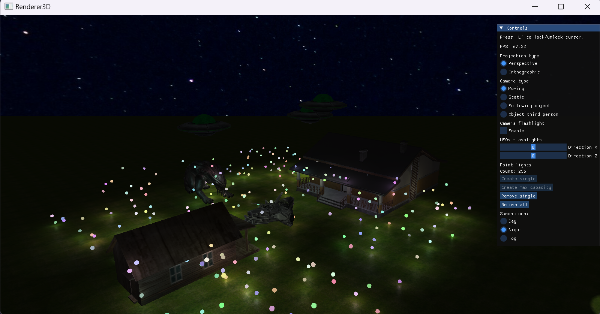

### Models, Entities and Scene

To encapsulate the logic behind models, including their vertices, normals, and textures, the [Model](src/model.h) class is used. It maintains a list of meshes that constitute the model and its associated textures. The class also provides functionality for rendering a model using an instance of the [Shader](src/shader.h) class.

The [Entity](src/entity.h) class holds a reference to a model and stores per-entity data such as position, rotation, and scale. This design ensures that when multiple entities share the same model, the model is loaded only once, which is critical since loading models can be time-consuming. Each entity stores only its unique data, while the model itself is shared. During rendering, an entity first updates the shader with its model matrix uniform before delegating rendering to the model.

All entities are managed by the [Scene](src/scene.h) class. It maintains a list of all entities and a map of functions to execute each frame. These functions act as update routines for entities, enabling simple animations such as moving or rotating objects within the scene.

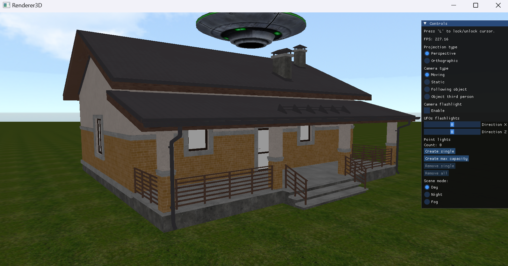
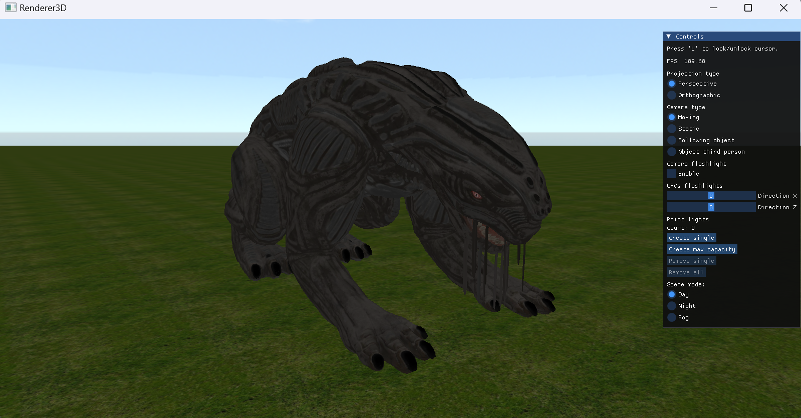
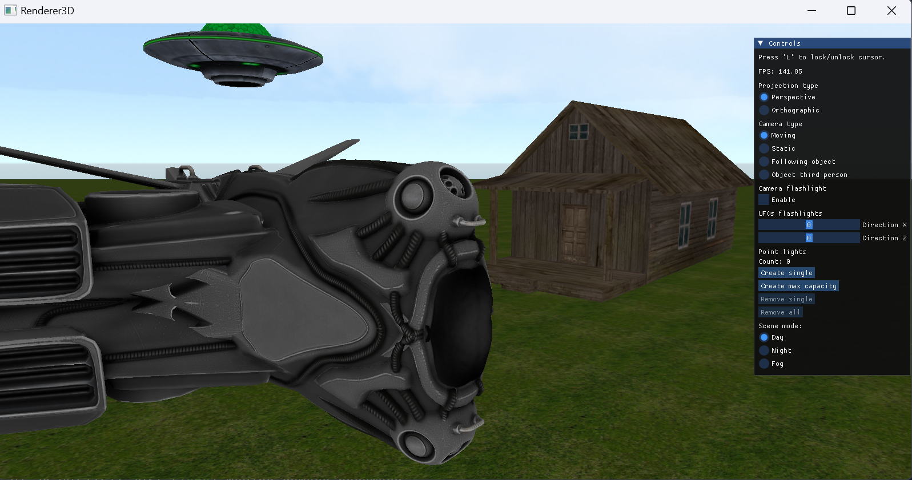

### Lighting

There are 3 types of light source supported:

1. **Directional light**:
   The direction of a directional light is always from top to bottom, meaning the only value passed to the shader is `ambientLevel`. A higher `ambientLevel` results in a lighter color for the object. The `ambientLevel` is determined by the `Scene mode` (highest during the day, lowest at night). The actual values can be found in the [DeferredShaderer](src/deferred_shaderer.h) class.

2. **Point light**:
   The system supports up to `MAX_NR_POINT_LIGHTS`, a constant defined in [PointLightsContainer](src/point_lights_container.h). This value must match the constant with the same name in the [Fragment Shader](assets/shaders/model_lighting_pass_fragment.glsl). Each point light source is rendered as a small sphere. You can spawn new point light sources or remove existing ones using the GUI options.

   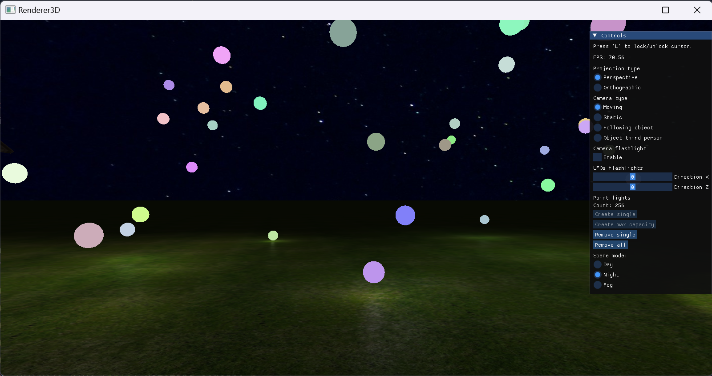

3. **Spotlight**:
   Spotlights can be attached to both cameras and entities. In the scene, every UFO has an attached spotlight. Additionally, when the camera type is set to `Moving`, there is an option to enable the camera's spotlight to simulate holding a flashlight. For UFO spotlights, there is an option to adjust their direction along the X-plane and Z-plane. Similar to point lights, there can be up to `MAX_NR_SPOT_LIGHTS`, a constant defined in [spot_light_source.h](src/spot_light_source.h). This value must match the constant with the same name in the [Fragment Shader](assets/shaders/model_lighting_pass_fragment.glsl).

   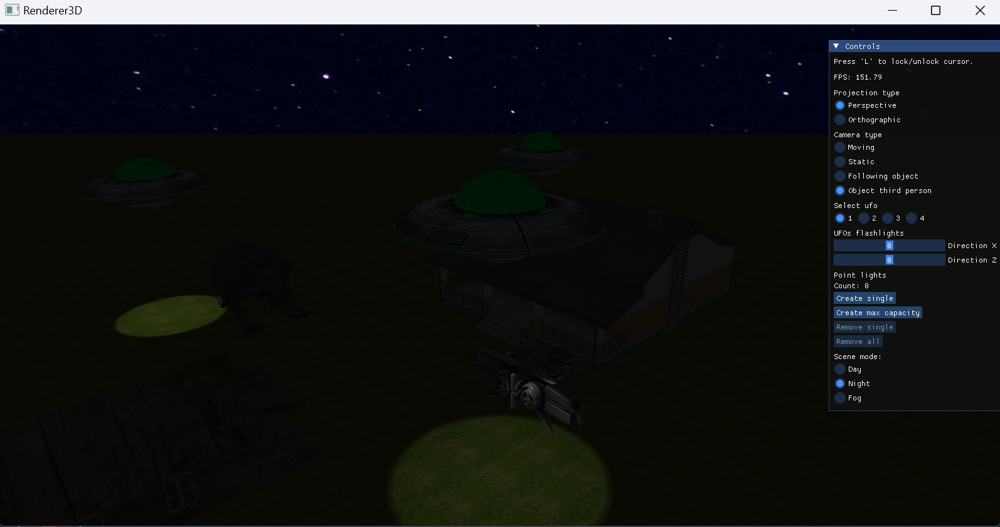
   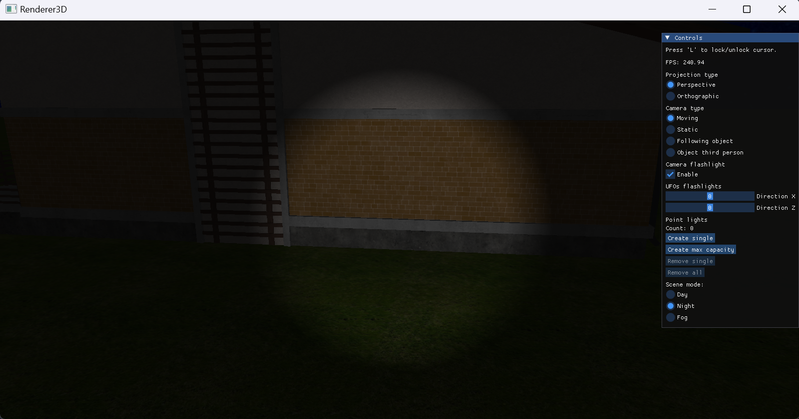

### Day-Night

Renderer3D supports switching between day and night. This option adjusts `ambientLevel` and changes the skybox to create a more realistic effect.

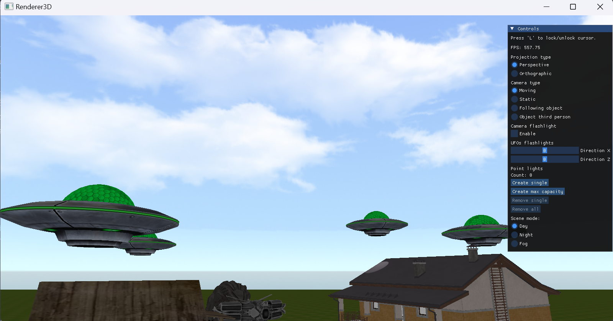
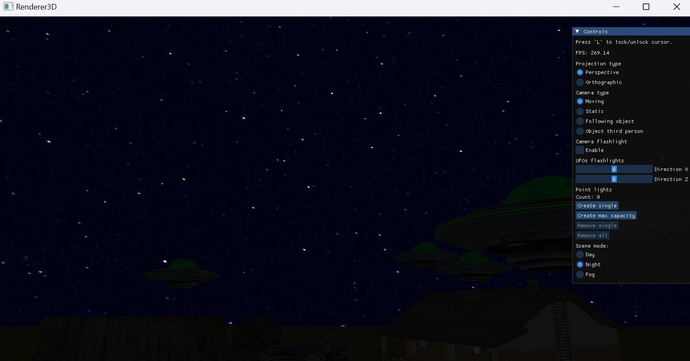

### Fog

There is an option to set `SceneMode` to `Fog`. In this mode, distant objects appear blurry and foggy. The GUI includes a slider to adjust the fog strength. Function `applyFogEffect` in [Fragment Shader](assets/shaders/model_lighting_pass_fragment.glsl) is responsbile for calculating the fog effect.

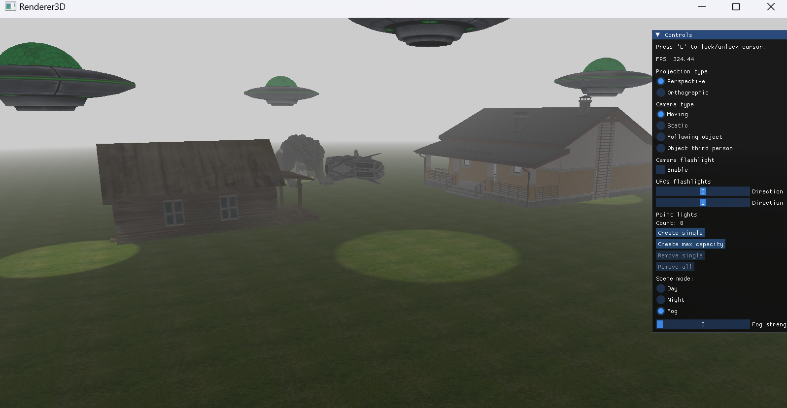
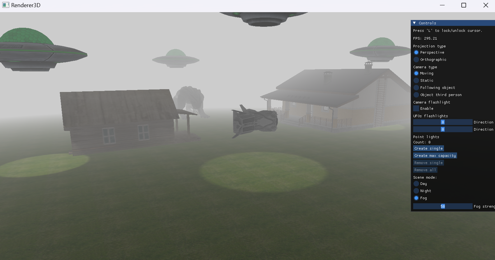
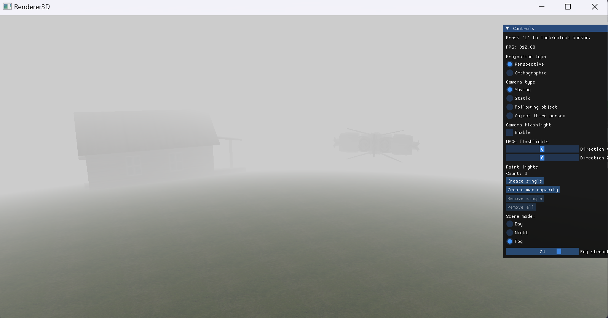

### Projection

Renderer3D supports switching the projection type from the default `perspective` to `orthographic`. The latter may feel unusual, but it is commonly used in CAD-like software, where maintaining accurate proportions and measurements is essential.

In **perspective projection**, objects appear smaller as they move further away, mimicking how the human eye perceives depth. This creates a sense of realism but can distort object proportions.

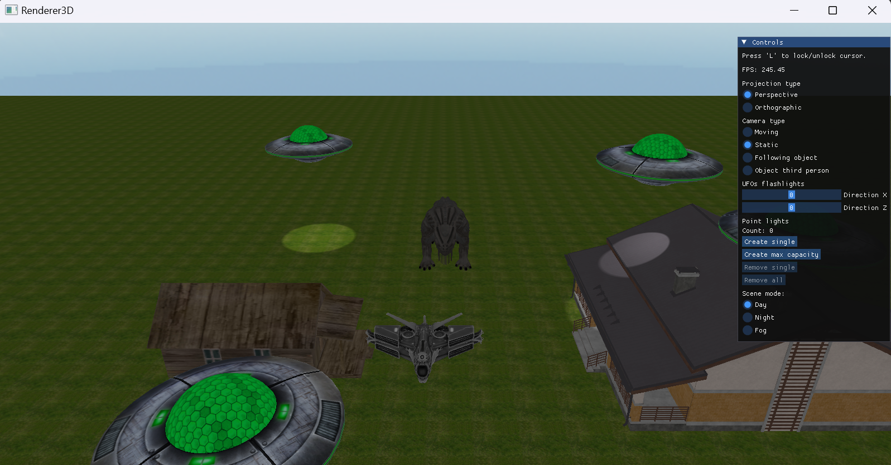

In **orthographic projection**, objects remain the same size regardless of their distance from the camera. This is useful for technical drawings, architectural visualization, and CAD applications.

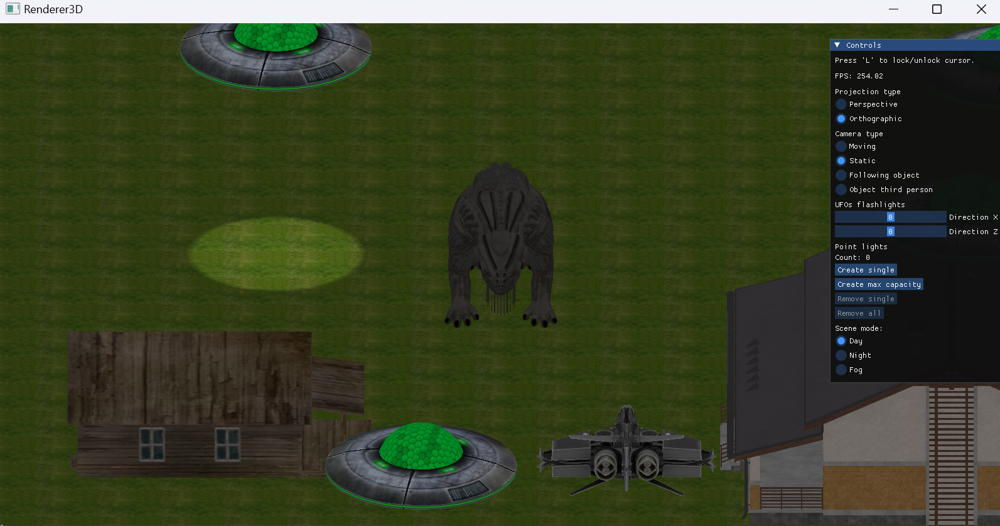

The two above examples were both made in the exactly same camera spot and angle, the only difference is projection type.

### Cameras

There are four types of cameras in this application:

1. **Moving**  
   This camera allows you to freely navigate around the scene. Use **W/S/A/D** to move forward, backward, left, and right, respectively. The **spacebar** moves the camera up, while **left shift** moves it down. It is the only camera that supports enabling the flashlight.

   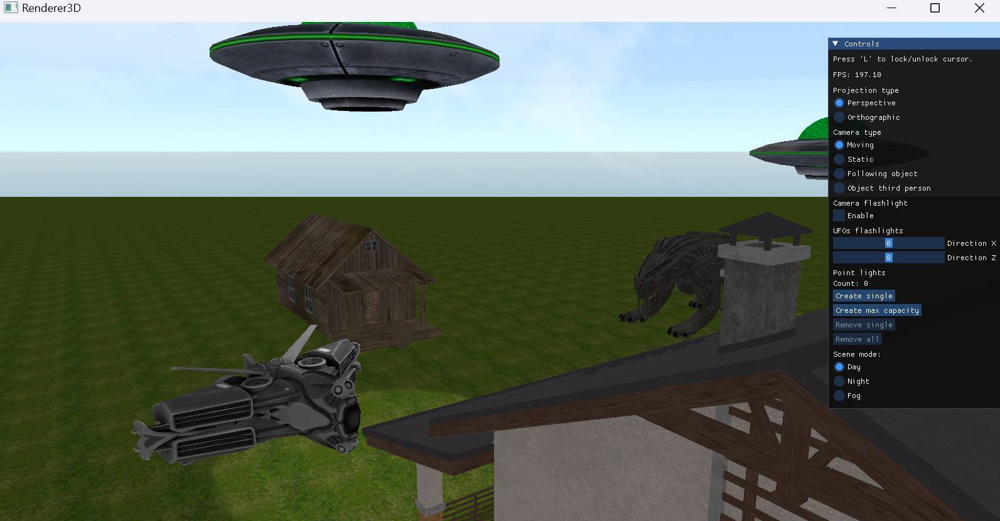

2. **Static**  
   The static camera is fixed in one position and cannot be moved or adjusted. It is ideal for observing all models in the scene from a predefined viewpoint.

   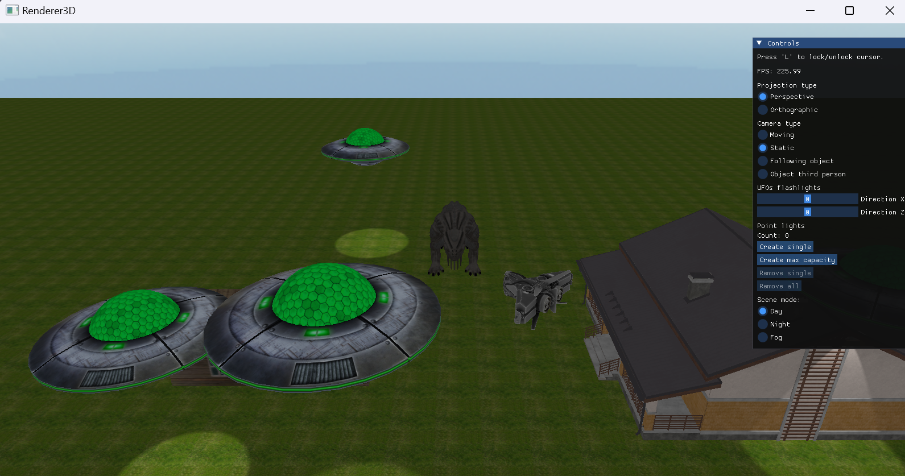

3. **Following UFO**  
   Positioned at the center of the scene, this camera follows one of the four UFOs, as selected by the user.

   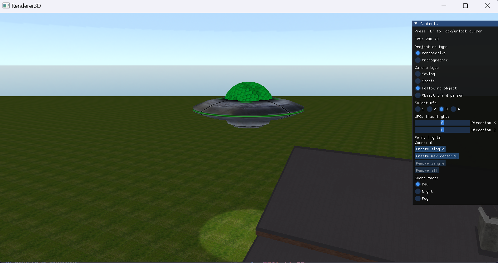

4. **Third-Person UFO**  
   This camera follows the chosen UFO from just behind it, updating its position in sync with the UFO. It functions similarly to a third-person camera in video games.

   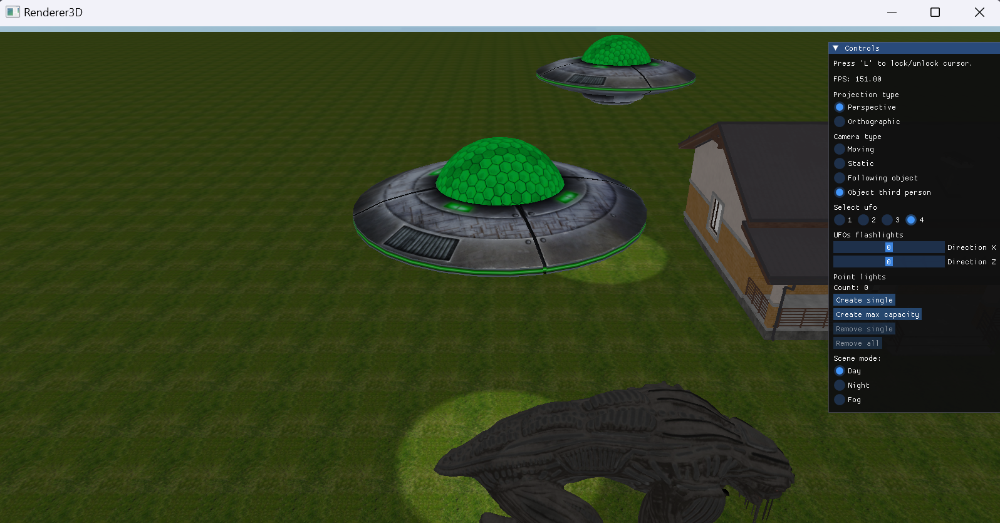

## 3rd Party Libraries

Renderer3D uses following 3rd party libraries:

- `assimp` - model loading
- `glad` - OpenGL bindings
- `glfw` - handling window
- `glm` - math operations
- `imgui` - controls gui
- `spdlog` - logging
- `stb_image` - image loading

## Disclaimer

Due to rather big size `assets/models` are not included in the git repository.
